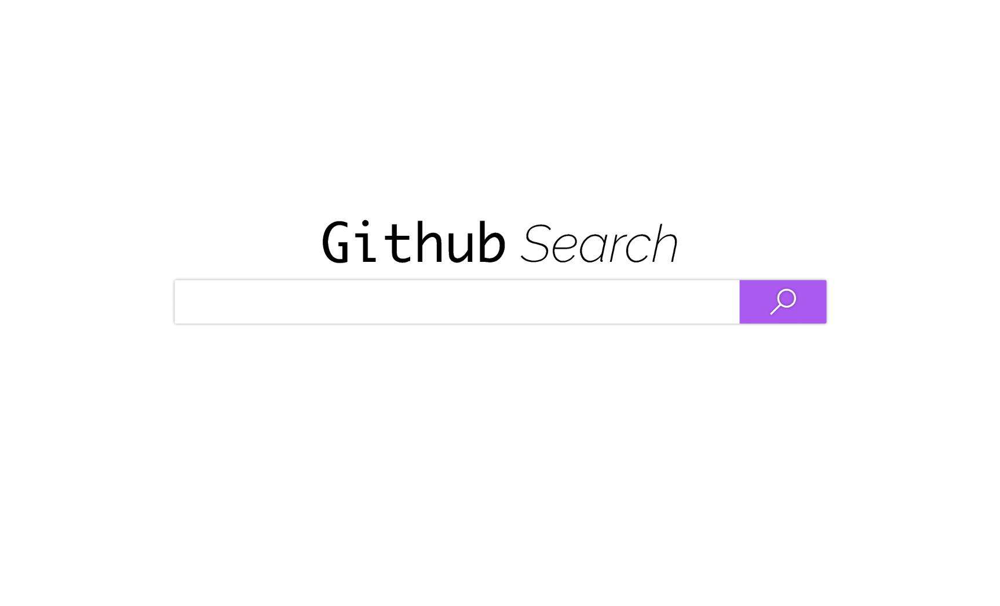
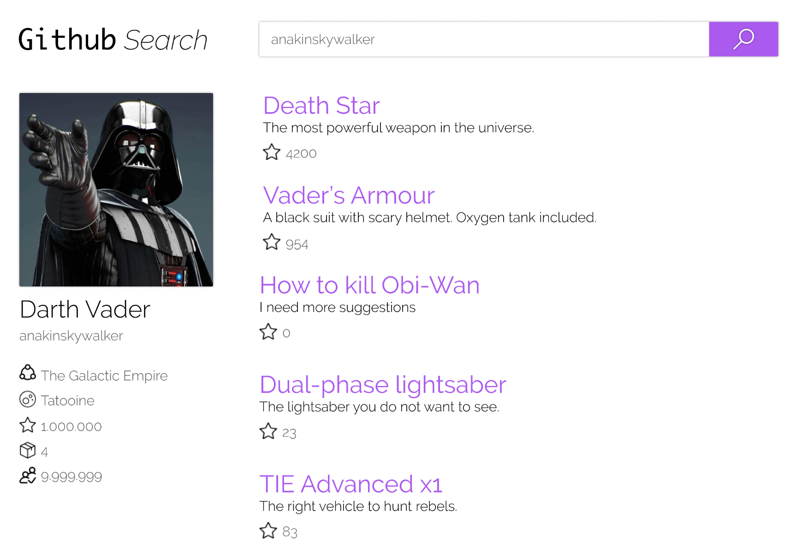
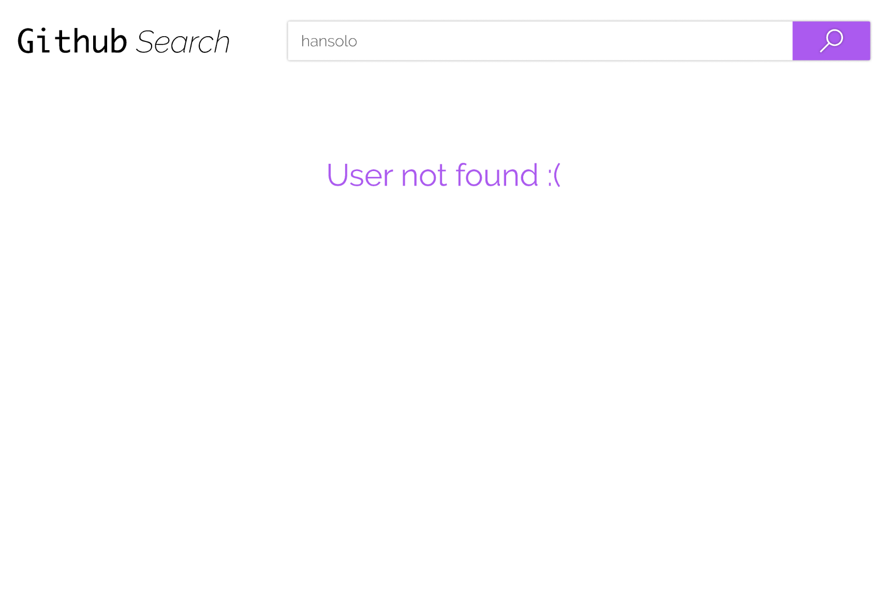

<h1 align="center">
  
  
</h1>

<h3 align="center">
  Concrete Solutions. 
  <p/>
  <p>Implement a client-side application, which consults the GitHub API and shows the repositories of a particular user. This application should work on the latest browsers on the market.</p>
</h3>

<p align="center">
  
  
  
  

  <a href="https://github.com/joaogasparr/github-starwars/stargazers">
    
  </a>
</p>

## :rocket: Getting Started

The following instructions show how the concrete solutions challenge should be executed.

### Prerequisites

- [API Documentation](https://developer.github.com/v3/)
- [Get a Single User](https://api.github.com/users/:username)
- [List User Repositories](https://api.github.com/users/:username/repos)

### Layout

Shared layout via [Zeplin.io](https://zpl.io/VxYQp7g)

```
# User
$> desafio_concrete

# Password
$> challengeaccepted

```

### Navigation

```
● When searching for a user through github login, direct to result screen search

● If user is found present user details page (Layout result), otherwise display friendly message (Layout NotFound)
```

### Requirements

```
● I as a user wish to search for a GitHub user

● I, as a user, want to see the details of this searched user (number of followers, number of followed, avatar image, email and bio)

● I, as a user, want to see the listing of this user's repositories that was fetched
```

### Definition of done

```
● The layout must be implemented according to the Zeplin.io specification.

● A framework is not required, but we recommend React.js

● The use of routes is required.
```

### Preview


## Home


## Result 


## NotFound


---

## :memo: Licença

This project is licensed under the MIT License - see the [LICENSE](LICENSE) file for details

---

Made with ♥ by João Vitor Gaspar :wave: [See my linkedin!](https://www.linkedin.com/in/jo%C3%A3o-vitor-gaspar-b1b527170/)
